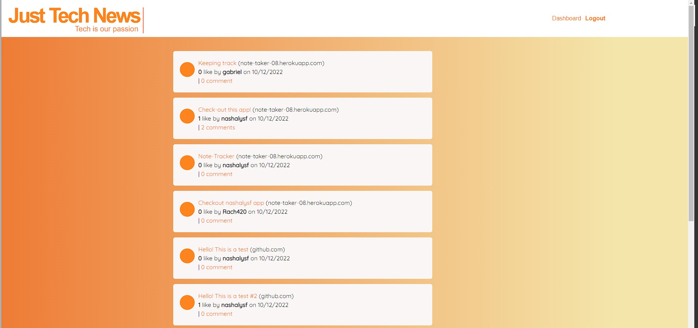

# Model-View-Controller (MVC)
## Just-Tech-News
Writing about tech can be just as important as making it. While devs spend time creating new apps and debugging existing codebases, most developers spend most of their time researchiong, reading and writing about tech concepts and advancements. The purpose of this excersice was to create a forum based social app where devs can share information that they found helpful or a recent app that they developed. While creating Just-Tech-News

The purpose of this project was to built a CMS-style blog site - similar to a WordPress site - where developers could publish their blog posts and comment on other developers' posts as well. This application follows the MVC paradigm in its architecture structure, atilizes Handlebars.js and JawsDB add-on as the templating language, Sequelize as the ORM, and the express-session npm package for authentication.

### Built With:
- HTML5 / CSS3
- JavaScript
- [Node.js](https://nodejs.org/en/) ES6
- [MySQL](https://dev.mysql.com/doc/)
- npm packages: [MySQL2](https://github.com/sidorares/node-mysql2#readme), [Sequelize](https://sequelize.org/), [Express Handlebars](https://github.com/express-handlebars/express-handlebars), [express-session](https://github.com/expressjs/session#readme), [connect-session-sequeilize](https://github.com/mweibel/connect-session-sequelize), [dotenv](https://github.com/motdotla/dotenv#readme), [node.bcrypt.js](https://github.com/kelektiv/node.bcrypt.js#readme)



### Live View:
[Heroku](https://just-tech-news-08.herokuapp.com/)

## Installation
1. To install this application, `git clone` this repo.
2. Ensure Node.js is installed in your operating system `npm i node`.
3. Create a `.env` file in the root directory and include your MySQL username (DB_USER) and password (DB_PASSWORD) between the single quotes:
```
DB_NAME='just_tech_news_db'
DB_USER=''
DB_PASSWORD=''
```
4. Install ***all*** of the npm packages listed above via command-line in terminal with `npm i -y`
5. Initialize MySQL by running `mysql -u root -p`, and enter your password when prompted. Once loaded, enter `SOURCE db/schema.sql;` to create the database. Exit MySQL by entering `quit;` in terminal.
6. The application can be accessed by visiting `http://localhost:3001` in the browser after running the following command:
```
`npm start` or
`node server.js`
```
7. [Insomnia](https://insomnia.rest/) or [Postman](https://www.postman.com/) can be used to check the backend functionality.

## Usage
* Create a free acount and start exploring the app functionalities!

Note: The edit page functionality to delete post and Dashboard page to change password are currently under development and are not currently functioning but soon it will!

## Learning Curve
* While creating this app I learned and practice:
1. To use proper code organization paradigms in a full-stack app, following the MVC paradigm to organize your code into Models, Views, and Controllers.
2. Used Handlebar.js a template engine to deliver front-end files along expressions and helpers.
3. Used Express.js and Sequelize to implement sessions. Restrict routes to only logged in users and write custom middleware for Express.js, while using Sequelize to manage SQL data.
4. Managed front-end JavaScript logic in an MVC app to make fetch requests on the front end.
5. Used an ORM (Object-Relational-Mapping) to translate the object model into a relational data model using associations.
6. Create all of the server endpoints using RESTful API standards to work with model’s data and execute CRUD 
7. Create a login route for authentication. Use environment variables to protect sensitive data while securing user passwords stored in a database with hashing.

## Questions?
For any questions about this repo, please contact me at [naferi.zoe@gmail.com](mailto:naferi.zoef@gmail.com).

To view more of my works, please visit my GitHub: [nashalysf](https://github.com/nashalysf).
